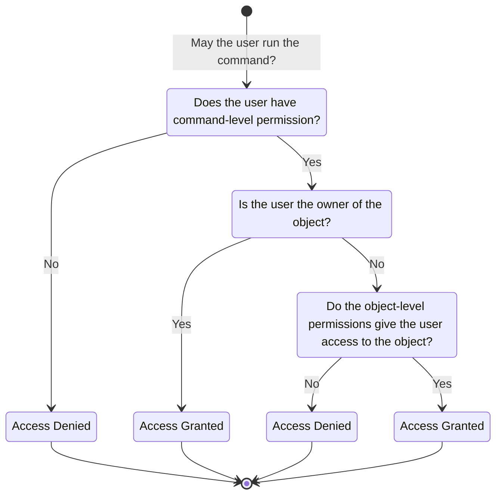
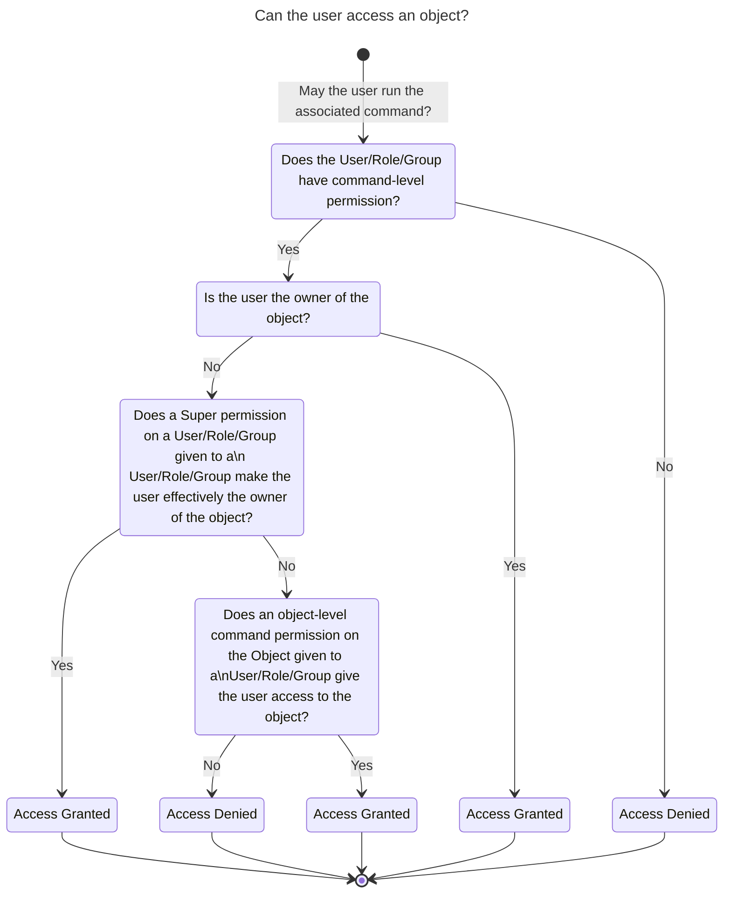

# Permissions <!-- omit in toc -->

- [Concept](#concept)
- [Details](#details)
  - [Basics](#basics)
    - [Resource Owners](#resource-owners)
    - [Permission Name](#permission-name)
    - [Subjects](#subjects)
    - [Command Permissions](#command-permissions)
    - [Resource permissions](#resource-permissions)
  - [Special Permissions and Rules](#special-permissions-and-rules)
    - ["Everything" Permission](#everything-permission)
    - ["Super" Permission](#super-permission)
    - ["Super User" Role](#super-user-role)
    - [Implicit "get\_..." Permission](#implicit-get_-permission)
    - [Implicit report and result permissions](#implicit-report-and-result-permissions)
  - [Database structure](#database-structure)
    - [Tables `permissions` and `permissions_trash`](#tables-permissions-and-permissions_trash)
    - [Table `permissions_get_tasks`](#table-permissions_get_tasks)
- [Full Access Tree](#full-access-tree)

## Concept

- Our data is a bunch of **Objects** also called **Resources**.
  Examples: *Targets*, *Tasks*, etc.
- Most important object: **User**
- Every object (there are some exceptions for global objects like *SecInfo*) has
  an **owner**, which is a a user.
- A user accesses objects via **commands**: `<get_targets/>`, etc.

These elements combine to give us **three part access**:

## Details

### Basics

#### Resource Owners

Most **GMP** resources (e.g. *tasks*, *configs*, *alerts*) are owned by a single
**user**, usually the one who created the resource.

Exceptions to this are *SecInfo* items like *NVTs* and *CVEs*, which do not have
an owner, resources inherited from a deleted user and resources added via a
feed, which are automatically assigned to a user specified in the global
**Feed Import Owner** setting (`78eceaec-3385-11ea-b237-28d24461215b`).

Owners can perform any any action on the owned resource if they they have the
general command permission (see below) to do so.

The owner of a resource cannot be changed except by deleting the old owner and
having another user inherit the resources.

#### Permission Name

The name of a permission has to be the name of the **GMP** command (like
`get_reports` or `create_target`) it is meant to grant access to.

#### Subjects

"Subject" in the context of permissions is the general term referring to users, groups and roles.

Each permission resource is assigned a single subject, but multiple permissions
for the same command and (optionally) resource can be created to grant the
permission to multiple subjects.

#### Command Permissions

Command permissions do not refer to a specific resource but are a prerequisite
a given GMP commands. For example, to get tasks, a subject needs the `get_tasks`
command permission.

However, the command permission alone only grants access to resources owned by
the user, so additional resource permissions (see below) may be required.

Internally any permissions without a reference to a specific resource are
considered command permissions.

#### Resource permissions

One way to allow access to a resource owned by another user is creating a
permission that references this specific resource.

### Special Permissions and Rules

#### "Everything" Permission

The **Everything** permission grants the subject access to all available **GMP**
commands, with the usual limitation of only being able to **access owned
resources** unless further permissions are given.

#### "Super" Permission

The **Super** permission grants the subject the permission to access all the
resources owned by another subject selected as the resource.

For example, to grant all users with the "Admin" role access to everything owned
by a group "Scan Users", you have to select the role "Admin" as the subject and
the group "Scan Users".

#### "Super User" Role

If no subject is given as the resource, access is granted to all the resources
of all users. However, this is only allowed for the predefined "Super User" role
that has to be assigned via the gvmd command line.

#### Implicit "get_..." Permission

If the permission to modify resources of a certain type (e.g. `modify_target`)
is granted, the subject is **implicitly also allowed to get the resource** with
the corresponding `get_`... command (like `get_targets` for example).

#### Implicit report and result permissions

If permissions are granted for a **task** the subject will also be **allowed to
get all the reports** of that task as well as the **results, report hosts and
report host details** in these reports.

> [!NOTE]
> There is currently no mechanism that implicitly grants permissions for assets
> generated by a task or that automatically generates permissions for them.

### Database structure

#### Tables `permissions` and `permissions_trash`

Permissions are stored in the `permissions` table and are moved to
`permissions_trash` if deleted without the `ultimate="1"` option.

| Column            | Type    | Constraints                              | Description                                                 |
| ----------------- | ------- | ---------------------------------------- | ----------------------------------------------------------- |
| id                | SERIAL  | PRIMARY KEY                              | internal row id                                             |
| uuid              | text    | UNIQUE NOT NULL                          | UUID used as identifier in GMP                              |
| owner             | integer | REFERENCES users (id) ON DELETE RESTRICT | owner of the permission                                     |
| name              | text    | NOT NULL                                 | the GMP command the permission is for                       |
| comment           | text    |                                          | a user-defined comment (optional)                           |
| resource_type     | text    |                                          | the internal type of the resource, e.g. *report_format* `*` |
| resource          | integer |                                          | internal row id of the resource `*`                         |
| resource_uuid     | text    |                                          | UUID of the resource `*``                                   |
| resource_location | integer |                                          | whether the resource is in the trashcan `*`                 |
| subject_type      | text    |                                          | the subject type (, or) user group role                     |
| subject           | integer |                                          | internal row id of the subject                              |
| subject_location  | integer |                                          | whether the subject is in the trashcan                      |
| creation_time     | integer |                                          | creation time as seconds since UNIX epoch                   |
| modification_time | integer |                                          | last modification time as seconds since UNIX epoch          |

`*` If a resource is given all fields should be set, otherwise they should be empty

#### Table `permissions_get_tasks`

The `permissions_get_tasks` table is a **cache** that stores whether a **user
has read access (get_tasks) to a given task** and has to be updated whenever any
 task or "Super" permissions are modified.

Unlike other tables with references, entries here are deleted automatically by
the database if a task or user is deleted.

To avoid (possibly inconsistent) duplicate entries, the table also has the
constraint that all user-task pairs must be unique (`UNIQUE ("user", task))`).

| Column         | Type    | constraints                        | Description                 |
| -------------- | ------- | ---------------------------------- | --------------------------- |
| user           | integer | REFERENCES users ON DELETE CASCADE | the user to consider        |
| task           | integer | REFERENCES tasks ON DELETE CASCADE | the task to consider        |
| has_permission | boolean |                                    | whether the user has access |

## Full Access Tree

