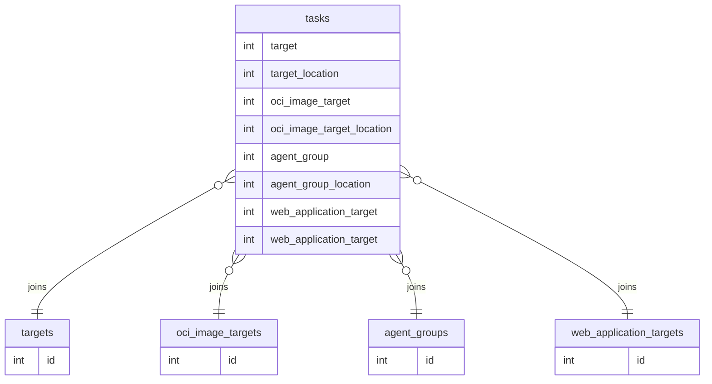
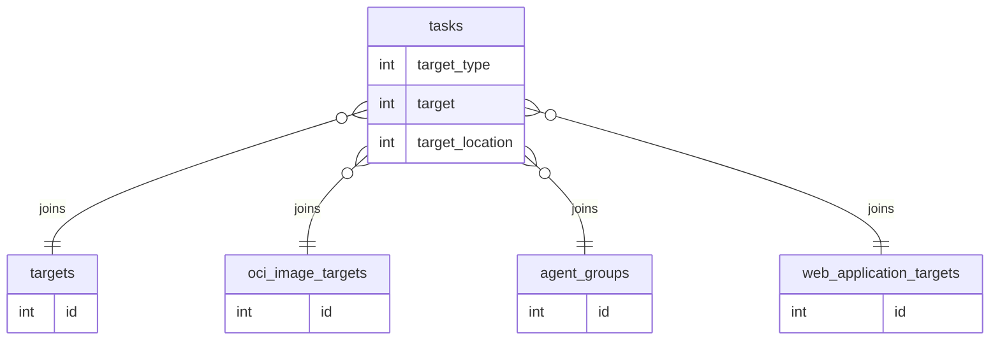

# Migrate to a `target_type` column for `tasks`

## What

Modernize `gvmd`'s code- and database. Specifically the `tasks` components, by introducing the concept of a
`target_type`.

## Why

Currently, we add columns to the `tasks` table, for different types of targets.

The columns `oci_image_target`, `agent_group` and `web_application_target` are artifacts of this phenomenon.
In addition to these `*target` columns, each comes with their related `*_location` column, indicating
whether this resource is found in the trash.



This makes it cumbersome to add a new type of target. Also, it is quite confusing, as the column `target` is still in
place, but refers only to the legacy definition of a target.

By introducing a `target_type` column, and migrating the then unnecessary columns `oci_image_target`, `agent_group`
and `web_application_target` accordingly, we make intent more clear and concise.

After introducing the `target_type` column, we keep the different target tables, as shown below.
This will make it a lot easier to introduce further target types in the future, without adding a lot of
duplicate code for handling tasks.



# Target Types

These are the proposed target types, part of the initial migration

| Target Type                   | Integer Value | Reference Table           | Notes                |
|-------------------------------|---------------|---------------------------|----------------------|
| `TARGET_TYPE_IMPORT_TASK`     | 0             | N/A                       | `target` must be `0` |
| `TARGET_TYPE_REGULAR`         | 1             | `targets`                 | N/A                  |
| `TARGET_TYPE_AGENT_GROUP`     | 2             | `agent_groups`            | N/A                  |
| `TARGET_TYPE_OCI_IMAGE`       | 3             | `oci_image_targets`       | N/A                  |
| `TARGET_TYPE_WEB_APPLICATION` | 4             | `web_application_targets` | N/A                  |

# Migrations

## Data migration

While migrating the data seems rather trivial, we should opt for creating a database backup
prior to migrating the columns and data.

The migration consists of multiple steps:

1. ```postgresql
    ALTER TABLE tasks ADD target_type INTEGER
   ```
2. Pseudocode for migrating table contents
    ```python
    start_transaction()
    for row in tasks:
        if row.agent_group:
            row.target = row.agent_group
            row.target_location = row.agent_group_location
            row.target_type = TARGET_TYPE_AGENT_GROUP
        elif row.oci_image_target:
            row.target = row.oci_image_target
            row.target_location = row.oci_image_target_location
            row.target_type = TARGET_TYPE_OCI_IMAGE
        elif row.web_application_target:
            row.target = row.web_application_target
            row.target_location = row.web_application_target_location
            row.target_type = TARGET_TYPE_WEB_APPLICATION
        elif row.target != 0:
            row.target_type = TARGET_TYPE_REGULAR
        else:
            row.target_type = TARGET_TYPE_IMPORT_TASK
    commit()
    ```
3. ```postgresql
    ALTER TABLE tasks DROP COLUMN oci_image_target, DROP COLUMN oci_image_target_location, DROP COLUMN web_application_target, DROP COLUMN web_application_target_location
   ```

**Concerns**

- If for some reason, multiple `*target` fields in any combination are set (e.g. `target` *and* `oci_image_target`),
  we cannot imply which target is correct. While this should never happen, we should be ready
  for this to happen anyway.

## Code migration

As per usual with these kinds of refactorings, some recurring changes have a pattern.

```postgresql
WHERE oci_image_target IS NOT NULL
=>

WHERE target_type = {{TARGET_TYPE_OCI_IMAGE}}
```

```postgresql
WHERE web_application_target = $1
=>

WHERE target = $1
AND target_type = {{TARGET_TYPE_WEB_APPLICATION}}
```

A group of `delete_... ()` and `restore_... ()` functions updates the respective `target` and `target_location`
in the tasks table. Since we are removing the designated columns for each target type,
we can generalize these functions.
```c++
void
task_update_delete_target (int resource_id, int trash_id) {
    sql_ps ("UPDATE tasks"
           " SET target = $1,"
           "     target_location = " G_STRINGIFY (LOCATION_TRASH)
           " WHERE target = $2"
           " AND target_location = " G_STRINGIFY (LOCATION_TABLE) ";",
           SQL_RESOURCE_PARAM (trash_id),
           SQL_RESOURCE_PARAM (resource_id),;
           NULL);
}

void;
task_update_restore_target (int trash_id, int restored_id) {
    sql_ps ("UPDATE tasks"
           " SET target = $1,"
           "     target_location = " G_STRINGIFY (LOCATION_TABLE)
           " WHERE target = $2"
           " AND target_location = " G_STRINGIFY (LOCATION_TRASH) ";",
           SQL_RESOURCE_PARAM (restored_id),
           SQL_RESOURCE_PARAM (trash_id),
           NULL);
}
```

<details>
    <summary>General functions</summary>

[manage_pg.c#L1293](https://github.com/greenbone/gvmd/blob/0e66fbe21cdfb489c3361c1ec6288d29de7cfc4f/src/manage_pg.c#L1293)
```c++
"  SELECT CASE"
"         WHEN EXISTS (SELECT id"
"                      FROM tasks"
"                      WHERE id = (SELECT task"
"                                  FROM reports WHERE id = $1)"
"                        AND oci_image_target IS NOT NULL)"
```

Migration: Add additional `if (db_version >= ...)`
=> `WHERE target_type = {{TARGET_TYPE_OCI_IMAGE}}`

---

[manage_pg.c#L1447](https://github.com/greenbone/gvmd/blob/0e66fbe21cdfb489c3361c1ec6288d29de7cfc4f/src/manage_pg.c#L1447)
```c++
"  SELECT CASE"
"         WHEN (SELECT target = 0 "
"               AND agent_group = 0 "
"               AND oci_image_target = 0 "
"               AND web_application_target = 0 "
"               FROM tasks WHERE id = $1)"
```

[manage_pg.c#L1473](https://github.com/greenbone/gvmd/blob/0e66fbe21cdfb489c3361c1ec6288d29de7cfc4f/src/manage_pg.c#L1473)
```c++
"  SELECT CASE"
"         WHEN (SELECT target = 0 "
"               AND agent_group = 0 "
"               AND oci_image_target = 0 "
"               FROM tasks WHERE id = $1)"
```

Migration: Add additional `if (db_version >= ...)`
=> `target = 0 AND target_type = {{TARGET_TYPE_IMPORT_TASK}}`, omit other columns

---

[manage_pg.c#L1562](https://github.com/greenbone/gvmd/blob/0e66fbe21cdfb489c3361c1ec6288d29de7cfc4f/src/manage_pg.c#L1562)
```c++
           /*  Skip running and import tasks. */
           "   WHEN (SELECT run_status = %u OR target = 0"
           "         FROM tasks WHERE id = $1)"

```

Migration => `AND target_type = {{TARGET_TYPE_IMPORT_TASK}}`

---

[manage_sql_filters.c#L1286](https://github.com/greenbone/gvmd/blob/0e66fbe21cdfb489c3361c1ec6288d29de7cfc4f/src/manage_sql_filters.c#L1286)
```c++
  if ((strcmp (type, "report") == 0)
      && (strcmp (keyword->string, "status") == 0))
    g_string_append_printf
     (order,
      " ORDER BY"
      "  (CASE WHEN (SELECT "
      "               ( "
      "                  target = 0 "
      "                  and COALESCE( agent_group, 0) = 0 "
      "                  and COALESCE( oci_image_target, 0) = 0"
      "               ) "
      "              FROM tasks"
      "              WHERE tasks.id = task)"
      "    THEN '0'"
      "    ELSE run_status_name (scan_run_status)"
      "         || (SELECT CAST (temp / 100 AS text)"
      "                    || CAST (temp / 10 AS text)"
      "                    || CAST (temp %% 10 as text)"
      "             FROM (SELECT report_progress (id) AS temp)"
      "                  AS temp_sub)"
      "    END)"
      " ASC");
  else if ((strcmp (type, "task") == 0)
           && (strcmp (keyword->string, "status") == 0))
    g_string_append_printf
     (order,
      " ORDER BY"
      "  (CASE WHEN ( target = 0 "
      "               and COALESCE( agent_group, 0) = 0 "
      "               and COALESCE( oci_image_target, 0) = 0"
      "             ) "
      "    THEN '0'"
      "    ELSE run_status_name (run_status)"
      "         || (SELECT CAST (temp / 100 AS text)"
      "                    || CAST (temp / 10 AS text)"
      "                    || CAST (temp %% 10 as text)"
      "             FROM (SELECT report_progress (id) AS temp"
      "                   FROM reports"
      "                   WHERE task = tasks.id"
      "                   ORDER BY creation_time DESC LIMIT 1)"
      "                  AS temp_sub)"
      "    END)"
      " ASC");
```

Migration =>

---

[manage_sql_filters.c#L1491](https://github.com/greenbone/gvmd/blob/0e66fbe21cdfb489c3361c1ec6288d29de7cfc4f/src/manage_sql_filters.c#L1491)
```c++
if ((strcmp (type, "report") == 0)
      && (strcmp (keyword->string, "status") == 0))
    g_string_append_printf
     (order,
      " ORDER BY"
      "  (CASE WHEN (SELECT "
      "               ( "
      "                  target = 0 "
      "                  and COALESCE( agent_group, 0) = 0 "
      "                  and COALESCE( oci_image_target, 0) = 0"
      "               ) "
      "              FROM tasks"
      "              WHERE tasks.id = task)"
      "    THEN '0'"
      "    ELSE run_status_name (scan_run_status)"
      "         || (SELECT CAST (temp / 100 AS text)"
      "                    || CAST (temp / 10 AS text)"
      "                    || CAST (temp %% 10 as text)"
      "             FROM (SELECT report_progress (id) AS temp)"
      "                  AS temp_sub)"
      "    END)"
      " DESC");
  else if ((strcmp (type, "task") == 0)
           && (strcmp (keyword->string, "status") == 0))
    g_string_append_printf
     (order,
      " ORDER BY"
      "  (CASE WHEN ( target = 0 "
      "               and COALESCE( agent_group, 0) = 0 "
      "               and COALESCE( oci_image_target, 0) = 0"
      "             ) "
      "    THEN '0'"
      "    ELSE run_status_name (run_status)"
      "         || (SELECT CAST (temp / 100 AS text)"
      "                    || CAST (temp / 10 AS text)"
      "                    || CAST (temp %% 10 as text)"
      "             FROM (SELECT report_progress (id) AS temp"
      "                   FROM reports"
      "                   WHERE task = tasks.id"
      "                   ORDER BY creation_time DESC LIMIT 1)"
      "                  AS temp_sub)"
      "    END)"
      " DESC");
```

Migration =>

---

[manage_sql.c#L18107](https://github.com/greenbone/gvmd/blob/0e66fbe21cdfb489c3361c1ec6288d29de7cfc4f/src/manage_sql.c#L18107)
```c++
task_t
make_task (char* name, char* comment, int in_assets, int event)
```

Migration => set `target_type`

---

[manage_sql.c#L5850](https://github.com/greenbone/gvmd/blob/0e66fbe21cdfb489c3361c1ec6288d29de7cfc4f/src/manage_sql.c#L5850)
```c++
void
set_task_target (task_t task, target_t target)
{
  sql ("UPDATE tasks SET target = %llu, modification_time = m_now ()"
       " WHERE id = %llu;",
       target,
       task);
}
```

Migration => set `target_type`

---

[manage_sql.c#L18228](https://github.com/greenbone/gvmd/blob/0e66fbe21cdfb489c3361c1ec6288d29de7cfc4f/src/manage_sql.c#L18228)
```c++
copy_task(...)
...

  ret = copy_resource_lock ("task", name, comment, task_id,
                            "config, target, oci_image_target,"
                            " web_application_target,"
                            " schedule, schedule_periods,"
                            " scanner, schedule_next_time,"
                            " config_location, target_location,"
                            " schedule_location, scanner_location,"
                            " oci_image_target_location,"
                            " web_application_target_location,"
                            " usage_type,"
                            " agent_group, agent_group_location,"
                            " alterable",
                            1, &new, &old);

```

Migration => remove unused fields, copy `target_type` instead

---

</details>

<details>
    <summary>Agent groups</summary>

[manage_sql.c#L5866](https://github.com/greenbone/gvmd/blob/0e66fbe21cdfb489c3361c1ec6288d29de7cfc4f/src/manage_sql.c#L5866)
```c++
void
set_task_agent_group_and_location (task_t task, agent_group_t agent_group)
{
  sql ("UPDATE tasks SET agent_group = %llu, agent_group_location = 0,"
       " modification_time = m_now ()"
       " WHERE id = %llu;",
       agent_group,
       task);
}
```

Migration =>

---

[manage_sql.c#L5884](https://github.com/greenbone/gvmd/blob/0e66fbe21cdfb489c3361c1ec6288d29de7cfc4f/src/manage_sql.c#L5884)
```c++
int
agent_group_tasks_exist_by_scanner (scanner_t scanner)
{
  return !!sql_int (
    "SELECT COUNT(*) FROM tasks"
    " WHERE agent_group IN ("
    "  SELECT id FROM agent_groups WHERE scanner = %llu)"
    " AND agent_group_location = "
    G_STRINGIFY (LOCATION_TABLE)
    " AND hidden = 0;",
    scanner);
}
```

Migration =>

---

[manage_sql.c#L5903](https://github.com/greenbone/gvmd/blob/0e66fbe21cdfb489c3361c1ec6288d29de7cfc4f/src/manage_sql.c#L5903)
```c++
int
agent_group_hidden_tasks_exist_by_scanner (scanner_t scanner)
{
  return !!sql_int (
    "SELECT COUNT(*) FROM tasks "
    "WHERE hidden != 0 "
    " AND ("
    "  (agent_group_location = %d"
    "   AND agent_group IN ("
    "    SELECT id FROM agent_groups WHERE scanner = %llu ))"
    " OR "
    "  (agent_group_location = %d "
    "   AND agent_group IN ("
    "    SELECT id FROM agent_groups_trash WHERE scanner = %llu ))"
    ");",
    LOCATION_TABLE, scanner, LOCATION_TRASH, scanner);
}
```

Migration =>

---

[manage_sql.c#L5931](https://github.com/greenbone/gvmd/blob/0e66fbe21cdfb489c3361c1ec6288d29de7cfc4f/src/manage_sql.c#L5931)
```c++
switch (sql_int64 (&agent_group,
                 "SELECT agent_group FROM tasks WHERE id = %llu;",
                 task))
```

Migration =>

---

[manage_sql.c#L5954](https://github.com/greenbone/gvmd/blob/0e66fbe21cdfb489c3361c1ec6288d29de7cfc4f/src/manage_sql.c#L5954)
```c++
int
task_agent_group_in_trash (task_t task)
{
  return sql_int ("SELECT agent_group_location = "
                  G_STRINGIFY (LOCATION_TRASH)
                  " FROM tasks WHERE id = %llu;",
                  task);
}
```

Migration =>

---

[manage_sql_agent_groups.c#L59](https://github.com/greenbone/gvmd/blob/0e66fbe21cdfb489c3361c1ec6288d29de7cfc4f/src/manage_sql_agent_groups.c#L59)
```c++
static int
agent_group_in_use_in_hidden_task (agent_group_t agent_group)
{
  return !!sql_int ("SELECT COUNT(*) FROM tasks "
                    "WHERE hidden != 0 AND agent_group = %llu;",
                    agent_group);
}
```

Migration =>

---

[manage_sql_agent_groups.c#L556](https://github.com/greenbone/gvmd/blob/0e66fbe21cdfb489c3361c1ec6288d29de7cfc4f/src/manage_sql_agent_groups.c#L556)
```c++
int
delete_agent_group (const char *agent_group_uuid, int ultimate)
```

Migration => `update_trashcan_task_target ()`

[manage_sql_agent_groups.c#L1029](https://github.com/greenbone/gvmd/blob/0e66fbe21cdfb489c3361c1ec6288d29de7cfc4f/src/manage_sql_agent_groups.c#L1029)
```c++
int
agent_group_in_use (agent_group_t agent_group)
{
  return !!sql_int ("SELECT count(*) FROM tasks"
                    " WHERE agent_group = %llu"
                    " AND agent_group_location = "
                    G_STRINGIFY (LOCATION_TABLE)
                    " AND hidden = 0;",
                    agent_group);
}
```

Migration =>

---

[manage_sql_agent_groups.c#L1046](https://github.com/greenbone/gvmd/blob/0e66fbe21cdfb489c3361c1ec6288d29de7cfc4f/src/manage_sql_agent_groups.c#L1046)
```c++
int
trash_agent_group_in_use (agent_group_t agent_group)
{
  return !!sql_int ("SELECT count(*) FROM tasks"
                    " WHERE agent_group = %llu"
                    " AND agent_group_location = "
                    G_STRINGIFY (LOCATION_TRASH),
                    agent_group);
}
```

Migration =>

---

</details>

<details>
    <summary>OCI Image targets</summary>

[manage_sql.c#L5976](https://github.com/greenbone/gvmd/blob/0e66fbe21cdfb489c3361c1ec6288d29de7cfc4f/src/manage_sql.c#L5976)
```c++
switch (sql_int64 (&oci_image_target,
                 "SELECT oci_image_target FROM tasks WHERE id = %llu;",
                 task))
```

Migration =>

---

[manage_sql.c#L5999](https://github.com/greenbone/gvmd/blob/0e66fbe21cdfb489c3361c1ec6288d29de7cfc4f/src/manage_sql.c#L5999)
```c++
int
task_oci_image_target_in_trash (task_t task)
{
  return sql_int ("SELECT oci_image_target_location = "
                  G_STRINGIFY (LOCATION_TRASH)
                  " FROM tasks WHERE id = %llu;",
                  task);
}
```

Migration =>

---

[manage_sql.c#L6014](https://github.com/greenbone/gvmd/blob/0e66fbe21cdfb489c3361c1ec6288d29de7cfc4f/src/manage_sql.c#L6014)
```c++
void
set_task_oci_image_target (task_t task, oci_image_target_t oci_image_target)
{
  sql ("UPDATE tasks SET oci_image_target = %llu,"
       " oci_image_target_location = 0,"
       " modification_time = m_now ()"
       " WHERE id = %llu;",
       oci_image_target,
       task);
}
```

Migration => set `target_type`, `target` and `target_location`

---

[manage_sql_oci_image_targets.c#L427](https://github.com/greenbone/gvmd/blob/0e66fbe21cdfb489c3361c1ec6288d29de7cfc4f/src/manage_sql_oci_image_targets.c#L427)
```c++
if (sql_int ("SELECT count(*) FROM tasks"
                   " WHERE oci_image_target = %llu"
                   " AND oci_image_target_location = "
                   G_STRINGIFY (LOCATION_TRASH) ";",
                   oci_image_target))
{
  sql_rollback ();
  return 1;
}
```

Migration => use `target_type` and regular fields instead

---

[manage_sql_oci_image_targets.c#L451](https://github.com/greenbone/gvmd/blob/0e66fbe21cdfb489c3361c1ec6288d29de7cfc4f/src/manage_sql_oci_image_targets.c#L451)
```c++
if (sql_int ("SELECT count(*) FROM tasks"
                   " WHERE oci_image_target = %llu"
                   " AND oci_image_target_location = "
                   G_STRINGIFY (LOCATION_TABLE)
                   " AND hidden = 0;",
                   oci_image_target))
{
  sql_rollback ();
  return 1;
}
```

Migration => use `target_type` and regular fields instead

---

[manage_sql_oci_image_targets.c#L473](https://github.com/greenbone/gvmd/blob/0e66fbe21cdfb489c3361c1ec6288d29de7cfc4f/src/manage_sql_oci_image_targets.c#L473)
```c++
sql ("UPDATE tasks"
           " SET oci_image_target = %llu,"
           "     oci_image_target_location = "
           G_STRINGIFY (LOCATION_TRASH)
           " WHERE oci_image_target = %llu"
           " AND oci_image_target_location = "
           G_STRINGIFY (LOCATION_TABLE) ";",
           sql_last_insert_id (),
           oci_image_target);
```

Migration => `task_update_delete_target ()`

---

[manage_sql_oci_image_targets.c#L490](https://github.com/greenbone/gvmd/blob/0e66fbe21cdfb489c3361c1ec6288d29de7cfc4f/src/manage_sql_oci_image_targets.c#L490)
```c++
  else if (sql_int ("SELECT count(*) FROM tasks"
                    " WHERE oci_image_target = %llu"
                    " AND oci_image_target_location = "
                    G_STRINGIFY (LOCATION_TABLE),
                    oci_image_target))
    {
      sql_rollback ();
      return 1;
    }
```

Migration => 

---

[manage_sql_oci_image_targets.c#L581](https://github.com/greenbone/gvmd/blob/0e66fbe21cdfb489c3361c1ec6288d29de7cfc4f/src/manage_sql_oci_image_targets.c#L581)
```c++
sql ("UPDATE tasks"
    " SET oci_image_target = %llu,"
    " oci_image_target_location = " G_STRINGIFY (LOCATION_TABLE)
    " WHERE oci_image_target = %llu"
    " AND oci_image_target_location = " G_STRINGIFY (LOCATION_TRASH),
    oci_image_target,
    resource);
```

=> `task_update_restored_target ()`


---

[manage_sql_oci_image_targets.c#L906](https://github.com/greenbone/gvmd/blob/0e66fbe21cdfb489c3361c1ec6288d29de7cfc4f/src/manage_sql_oci_image_targets.c#L906)
```c++
int
oci_image_target_in_use (oci_image_target_t oci_image_target)
{
  return !!sql_int ("SELECT count(*) FROM tasks"
                    " WHERE oci_image_target = %llu"
                    " AND oci_image_target_location = "
                    G_STRINGIFY (LOCATION_TABLE)
                    " AND hidden = 0;",
                    oci_image_target);
}
```

Migration =>

---

[manage_sql_oci_image_targets.c#L924](https://github.com/greenbone/gvmd/blob/0e66fbe21cdfb489c3361c1ec6288d29de7cfc4f/src/manage_sql_oci_image_targets.c#L924)
```c++
int
trash_oci_image_target_in_use (oci_image_target_t oci_image_target)
{
  return !!sql_int ("SELECT count(*) FROM tasks"
                    " WHERE oci_image_target = %llu"
                    " AND oci_image_target_location = "
                    G_STRINGIFY (LOCATION_TRASH),
                    oci_image_target);
}
```

Migration =>

---

[manage_sql_oci_image_targets.c#L979](https://github.com/greenbone/gvmd/blob/0e66fbe21cdfb489c3361c1ec6288d29de7cfc4f/src/manage_sql_oci_image_targets.c#L979)
```c++
  init_iterator (iterator,
                 "%s"
                 " SELECT name, uuid, %s FROM tasks"
                 " WHERE oci_image_target = %llu"
                 " AND hidden = 0"
                 " ORDER BY name ASC;",
                 with_clause ? with_clause : "",
                 available,
                 oci_image_target);
```

Migration =>

---

</details>

<details>
    <summary>Web application targets</summary>

[manage_sql.c#L6035](https://github.com/greenbone/gvmd/blob/0e66fbe21cdfb489c3361c1ec6288d29de7cfc4f/src/manage_sql.c#L6035)
```c++
web_application_target_t
task_web_application_target (task_t task)
{
  web_application_target_t web_application_target = 0;
  sql_int64_ps (&web_application_target,
                "SELECT web_application_target FROM tasks"
                " WHERE id = $1;",
                SQL_RESOURCE_PARAM(task),
                NULL);
  return web_application_target;
}
```

Migration =>

---

[manage_sql.c#L6054](https://github.com/greenbone/gvmd/blob/0e66fbe21cdfb489c3361c1ec6288d29de7cfc4f/src/manage_sql.c#L6054)
```c++
int
task_web_application_target_in_trash (task_t task)
{
  return sql_int_ps ("SELECT web_application_target_location = "
                     G_STRINGIFY (LOCATION_TRASH)
                     " FROM tasks WHERE id = $1;",
                     SQL_RESOURCE_PARAM(task),
                     NULL);
}
```

Migration =>

---

[manage_sql.c#L6070](https://github.com/greenbone/gvmd/blob/0e66fbe21cdfb489c3361c1ec6288d29de7cfc4f/src/manage_sql.c#L6070)
```c++
void
set_task_web_application_target (task_t task, web_application_target_t web_application_target)
{
  sql_ps ("UPDATE tasks SET web_application_target = $1,"
          " web_application_target_location = 0,"
          " modification_time = m_now ()"
          " WHERE id = $2;",
          SQL_RESOURCE_PARAM(web_application_target),
          SQL_RESOURCE_PARAM(task),
          NULL);
}
```

Migration => set `target_type`

---

[manage_sql_web_application_targets.c#L465](https://github.com/greenbone/gvmd/blob/0e66fbe21cdfb489c3361c1ec6288d29de7cfc4f/src/manage_sql_web_application_targets.c#L465)
```c++
  if (sql_int_ps ("SELECT count(*) FROM tasks"
                  " WHERE web_application_target = $1"
                  " AND web_application_target_location = "
                  G_STRINGIFY (LOCATION_TRASH) ";",
                  SQL_RESOURCE_PARAM (web_application_target),
                  NULL))
    {
      sql_rollback ();
      return 1;
    }
```

Migration =>
`task_in_use ()` function?
Or simply replace `web_application_target` and `*_location` with `target` and `target_location`

---

[manage_sql_web_application_targets.c#L497](https://github.com/greenbone/gvmd/blob/0e66fbe21cdfb489c3361c1ec6288d29de7cfc4f/src/manage_sql_web_application_targets.c#L497)
```c++
  if (sql_int_ps ("SELECT count(*) FROM tasks"
                  " WHERE web_application_target = $1"
                  " AND web_application_target_location = "
                  G_STRINGIFY (LOCATION_TABLE)
                  " AND hidden = 0;",
                  SQL_RESOURCE_PARAM (web_application_target),
                  NULL))
    {
      sql_rollback ();
      return 1;
    }
```

Migration =>
`task_in_use ()` function with optional hidden = 0 flag?
Or simply replace `web_application_target` and `*_location` with `target` and `target_location`

---

[manage_sql_web_application_targets.c#L522](https://github.com/greenbone/gvmd/blob/0e66fbe21cdfb489c3361c1ec6288d29de7cfc4f/src/manage_sql_web_application_targets.c#L522)
```c++
  sql_ps ("UPDATE tasks"
          " SET web_application_target = $1,"
          "     web_application_target_location = "
          G_STRINGIFY (LOCATION_TRASH)
          " WHERE web_application_target = $2"
          " AND web_application_target_location = "
          G_STRINGIFY (LOCATION_TABLE) ";",
          SQL_RESOURCE_PARAM (trash_web_application_target),
          SQL_RESOURCE_PARAM (web_application_target),
          NULL);
```

Migration => `update_task_delete_target ()`

---

[manage_sql_web_application_targets.c#L543](https://github.com/greenbone/gvmd/blob/0e66fbe21cdfb489c3361c1ec6288d29de7cfc4f/src/manage_sql_web_application_targets.c#L543)
```c++
  else if (sql_int_ps ("SELECT count(*) FROM tasks"
                       " WHERE web_application_target = $1"
                       " AND web_application_target_location = "
                       G_STRINGIFY (LOCATION_TABLE) ";",
                       SQL_RESOURCE_PARAM (web_application_target),
                       NULL))
```

Migration =>

---

[manage_sql_web_application_targets.c#L648](https://github.com/greenbone/gvmd/blob/0e66fbe21cdfb489c3361c1ec6288d29de7cfc4f/src/manage_sql_web_application_targets.c#L648)
```c++
  sql_ps ("UPDATE tasks"
          " SET web_application_target = $1,"
          " web_application_target_location = "
          G_STRINGIFY (LOCATION_TABLE)
          " WHERE web_application_target = $2"
          " AND web_application_target_location = "
          G_STRINGIFY (LOCATION_TRASH) ";",
          SQL_RESOURCE_PARAM (web_application_target),
          SQL_RESOURCE_PARAM (resource),
          NULL);
```

Migration => `update_task_restore_target ()`

---

[manage_sql_web_application_targets.c#L968](https://github.com/greenbone/gvmd/blob/0e66fbe21cdfb489c3361c1ec6288d29de7cfc4f/src/manage_sql_web_application_targets.c#L968)
```c++
int
web_application_target_in_use (web_application_target_t web_application_target)
{
  return !!sql_int_ps ("SELECT count(*) FROM tasks"
                       " WHERE web_application_target = $1"
                       " AND web_application_target_location = "
                       G_STRINGIFY (LOCATION_TABLE)
                       " AND hidden = 0;",
                       SQL_RESOURCE_PARAM (web_application_target),
                       NULL);
}
```

Migration =>

---

[manage_sql_web_application_targets.c#L988](https://github.com/greenbone/gvmd/blob/0e66fbe21cdfb489c3361c1ec6288d29de7cfc4f/src/manage_sql_web_application_targets.c#L988)
```c++
int
trash_web_application_target_in_use (
  web_application_target_t web_application_target)
{
  return !!sql_int_ps ("SELECT count(*) FROM tasks"
                       " WHERE web_application_target = $1"
                       " AND web_application_target_location = "
                       G_STRINGIFY (LOCATION_TRASH) ";",
                       SQL_RESOURCE_PARAM (web_application_target),
                       NULL);
}
```

Migration =>

---

[manage_sql_web_application_targets.c#L1055](https://github.com/greenbone/gvmd/blob/0e66fbe21cdfb489c3361c1ec6288d29de7cfc4f/src/manage_sql_web_application_targets.c#L1055)
```c++
init_iterator (iterator,
             "%s"
             " SELECT name, uuid, %s FROM tasks"
             " WHERE web_application_target = %llu"
             " AND hidden = 0"
             " ORDER BY name ASC;",
             with_clause ? with_clause : "",
             available,
             web_application_target);
```

Migration => `target_type`

---

</details>

