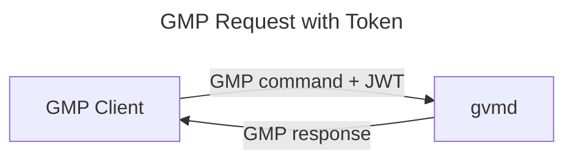
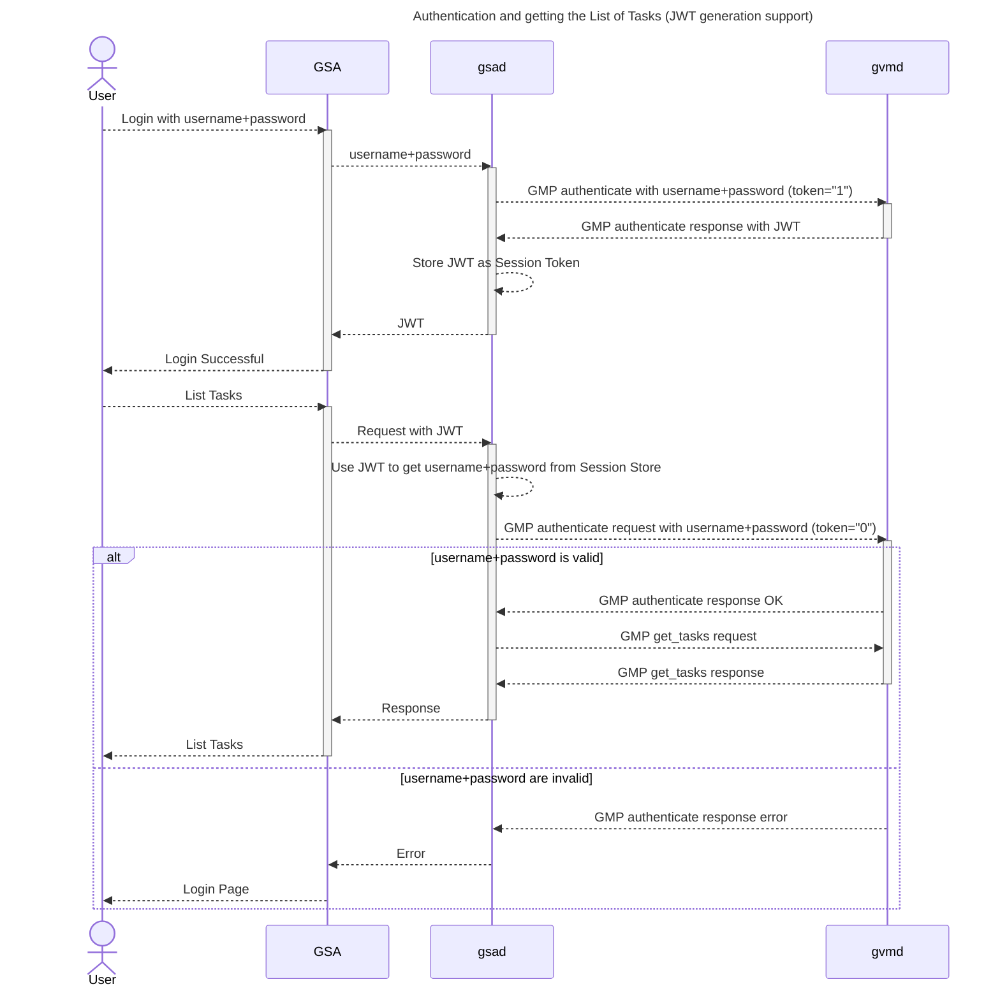
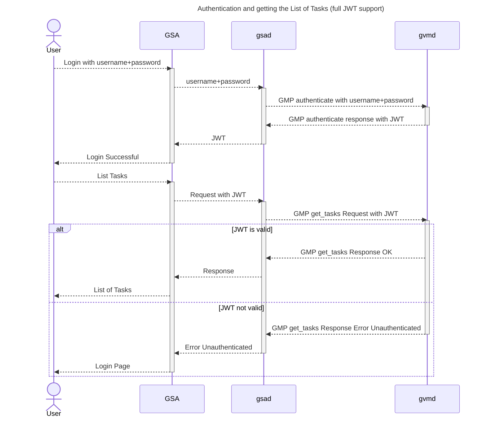

# Token Based Authentication <!-- omit in toc -->

In general it is desirable to use token based authentication and
[JSON Web Tokens (JWT)][JWT]
for the format of the tokens. It allows to implement *stateless* authentication
and therefore to split the authentication into another service.

A service getting the JWT from the client has to verify the token
signature only and can afterwards trust its content. The content of the JWT can
contain arbitrary data which in our case should be the user's permissions.

- [JWT Format](#jwt-format)
- [GMP Authentication](#gmp-authentication)
- [GMP Requests with Token](#gmp-requests-with-token)
- [Authentication Workflow](#authentication-workflow)
  - [Step 1](#step-1)
  - [Step 2](#step-2)

## JWT Format

The JWT should use the user id as subject (`sub`) and add [claims](https://en.wikipedia.org/wiki/JSON_Web_Token#Standard_fields)
for the user name, roles, groups and permissions. The roles, groups and
permissions can be used in the services to decide wether a user is allowed to
access a route.

Proposed JWT format

```json
{
  "sub": "<user id>",
  "exp": "<unix timestamp of current datetime + X>",
  "iat": "<unix timestamp of current datetime>",
  "username": "<username>",
  "roles": [
    "<roles of the user, for example>",
    "Admin",
    "User",
    "..."
  ],
  "groups": [
    "<groups of the user, for example>",
    "SomeGroup",
    "AnotherGroup",
    "..."
  ]
  "permissions": [
    "<permissions of the user, for example>",
    "get_tasks",
    "create_task",
    "..."
  ]
}
```

The expiry duration X should be between 5 and 15 minutes and should be
adjustable via a setting.

> [!NOTE]
> Adding the roles and permission and extending GMP with [token authentication](#gmp-authentication)
> would allow to remove permission queries from gvmd.

## GMP Authentication

Possible GMP extension of the current authentication workflow using tokens.

Client Request

```xml
 <authenticate token="1">
   <credentials>
     <username>sally</username>
     <password>secret</password>
   </credentials>
 </authenticate>
 ```

Response

```xml
 <authenticate_response status="200"
                        status_text="OK">
   <role>User</role>
   <timezone>UTC</timezone>
   <token><!-- JSON Web Token --></token>
 </authenticate_response>
```

Only return `<token>` with a JWT if the client requested it explicitly via
the `token` attribute. If it is equal "1" a JWT is returned.

## GMP Requests with Token

To support a single authentication mechanism GMP might be extended for token
based authentication.



Adding a new Root Element with token as first sub-element

```xml
<request>
  <token><!-- JSON Web Token --></token>
  <!-- standard GMP commands for example get_tasks -->
  <get_tasks ...>...</get_tasks>
</request>
```

> [!NOTE]
> `<token>` needs to be the first sub-element to be able to work with gvmd's
> state machine at the moment.

## Authentication Workflow

It is intended to support generating [JSON Web Tokens][JWT] in gvmd and also to
use it as an authentication mechanism in gvmd.

We can implement this solution in two steps

1. Provide a JWT from [GMP authentication](#gmp-authentication)
2. Allow to use JWT in [GMP commands](#gmp-requests-with-token)

In an additional later step the generation of the JWT can be moved into an own
service.

>[!NOTE]
> An idea is to implement JWT generation and validation in a Rust library and
> call it from C in gvmd. This will allow for an easy migration to a Rust based
> authentication service in future.

### Step 1

gvmd creates token on [request for a client](#gmp-authentication). It doesn't
support [using token in GMP requests](#gmp-requests-with-token) yet.



### Step 2

gvmd creates token on [request for a client](#gmp-authentication) and supports
[using token in GMP requests](#gmp-requests-with-token) now.



[JWT]: https://en.wikipedia.org/wiki/JSON_Web_Token
