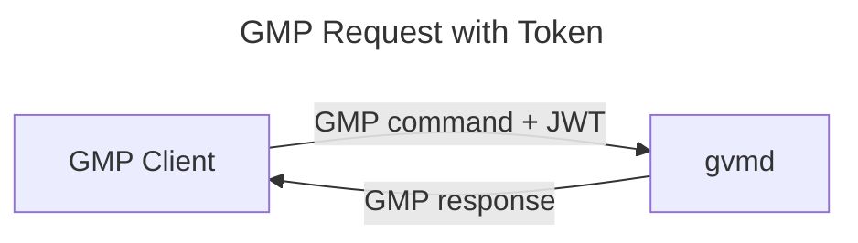
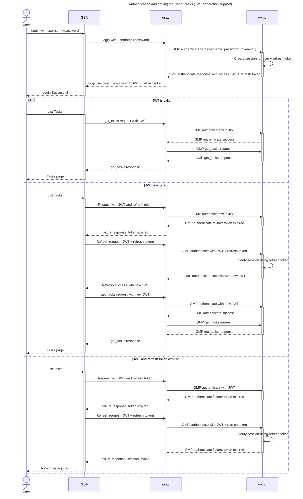

# Token Based Authentication <!-- omit in toc -->

In general it is desirable to use token based authentication and
[JSON Web Tokens (JWT)][JWT]
for the format of the tokens. It allows to implement *stateless* authentication
and therefore to split the authentication into another service.

A service getting the JWT from the client has to verify the token
signature only and can afterwards trust its content. The content of the JWT can
contain arbitrary data which in our case should be the user's permissions.

- [JWT Format](#jwt-format)
- [GMP Authentication](#gmp-authentication)
- [GMP Requests with Token](#gmp-requests-with-token)
- [Authentication Workflow](#authentication-workflow)
  - [Steps of the authentication process](#steps-of-the-authentication-process)

## JWT Format

The JWT should use the user id as subject (`sub`) and add [claims](https://en.wikipedia.org/wiki/JSON_Web_Token#Standard_fields)
for the user name and permissions. Optionally the roles and groups could be
added to if necessary. The permissions, roles and groups can be used in the
services to decide whether a user is allowed to access a route.

Proposed JWT format

```json
{
  "sub": "<user id>",
  "exp": "<unix timestamp of current datetime + X>",
  "iat": "<unix timestamp of current datetime>",
  "username": "<username>",
  "permissions": [
    "<permissions of the user, for example>",
    "get_tasks",
    "create_task",
    "..."
  ]
  "roles": [
    {"id": "<role-id-1>", "name": "<role-name-1>"},
    {"id": "7a8cb5b4-b74d-11e2-8187-406186ea4fc5", "name": "Admin"},
    {"id": "8d453140-b74d-11e2-b0be-406186ea4fc5", "name": "User"}
  ],
  "groups": [
    {"id": "<group-id-1>", "name": "<group-name-1>"},
    {"id": "45cf04ee-001f-4d60-99c6-02989d7dcd59", "name": "SomeGroup"},
    {"id": "6efc8ffd-2195-4d82-8bab-2b4a471035d8", "name": "AnotherGroup"}
  ]
}
```

The expiry duration X should be between 5 and 15 minutes and should be
adjustable via a setting.

> [!NOTE]
> Adding the roles and permission and extending GMP with [token authentication](#gmp-authentication)
> would allow to remove permission queries from gvmd.

## GMP Authentication

Possible GMP extension of the current authentication workflow using tokens.

Client Request

```xml
 <authenticate token="1">
   <credentials>
     <username>sally</username>
     <password>secret</password>
   </credentials>
 </authenticate>
 ```

Response

```xml
 <authenticate_response status="200"
                        status_text="OK">
   <role>User</role>
   <timezone>UTC</timezone>
   <token><!-- JSON Web Token --></token>
 </authenticate_response>
```

Only return `<token>` with a JWT if the client requested it explicitly via
the `token` attribute. If it is equal "1" a JWT is returned.

## GMP Requests with Token

To support a single authentication mechanism GMP might be extended for token
based authentication.


```mermaid
---
title: GMP Request with Token
---
flowchart LR
    client["GMP Client"]
    gvmd["gvmd"]

    client-->|GMP command + JWT|gvmd
    gvmd-->|GMP response|client
```

Adding a `<token>` sub-element to the `authenticate` GMP command as an
alternative to username and password:

```xml
<authenticate>
  <credentials>
    <token><!-- JSON Web Token --></token>
  </credentials>
</authenticate>
<!-- standard GMP commands for example get_tasks -->
<get_tasks ...>...</get_tasks>
```

Optional: Adding new Root Element expecting `<authenticate>` as
first sub-element:

```xml
<request>
  <authenticate>
    <credentials>
      <token><!-- JSON Web Token --></token>
    </credentials>
  </authenticate>
  <!-- standard GMP commands for example get_tasks -->
  <get_tasks ...>...</get_tasks>
</request>
```

> [!NOTE]
> `<authenticate>` needs to be the first sub-element to be able to work with
> gvmd's state machine at the moment.

## Authentication Workflow

It is intended to support generating [JSON Web Tokens][JWT] in gvmd as
access tokens that can be used for authentication in later GMP connections.

These are valid only for a short time, so gvmd will also create refresh
tokens with a longer lifetime that can be used to generate a new access
token as part of the authentication.

Additionally, gvmd will also take on the session handling, which is currently
part of gsad. For this, the refresh tokens will also serve as session
identifiers.
Whenever a refresh token is used, gvmd will check its session storage if
the session is still valid. Sessions will be invalidated by either expiring
or with the GMP logout command.

In an additional later step the session handling and token generation
can be moved into a separate service.

>[!NOTE]
> An idea is to implement JWT generation and validation in a Rust library and
> call it from C in gvmd. This will allow for an easy migration to a Rust based
> authentication service in future.

### Steps of the authentication process

When a user authenticates with username and password, gvmd creates an access
token and a refresh token as part of the [`<authenticate>` GMP response](#gmp-authentication).

As long as the access token is valid, it can be used for the authentication
required by other commands like getting the list of tasks.

If the access token expires, GSA can send a refresh request that contains
both the access token and the refresh token. If the access token is otherwise
valid and the refresh token is valid for an active session, a new access
token will be returned.


```mermaid
---
title: Authentication and getting the List of Tasks (JWT generation support)
---
sequenceDiagram

    actor User
    participant GSA
    participant gsad
    participant gvmd

    User->>GSA: Login with username+password
    activate GSA
    GSA->>gsad: Login with username+password
    activate gsad
    gsad->>gvmd: GMP authenticate with username+password (token="1")
    activate gvmd
    gvmd->>gvmd: Create session for user + refresh token
    gvmd-->>gsad: GMP authenticate response with access JWT + refresh token
    deactivate gvmd
    gsad-->>GSA: Login success message with JWT + refresh token
    deactivate gsad
    GSA-->>User: Login Successful
    deactivate GSA

    alt JWT is valid
        User->>GSA: List Tasks
        activate GSA
        GSA->>gsad: get_tasks request with JWT
        activate gsad
        gsad->>gvmd: GMP authenticate with JWT
        activate gvmd
        gvmd-->>gsad: GMP authenticate success
        gsad->>gvmd: GMP get_tasks request
        gvmd-->>gsad: GMP get_tasks response
        deactivate gvmd
        gsad-->>GSA: get_tasks response
        deactivate gsad
        GSA-->>User: Tasks page
        deactivate GSA
    else JWT is expired
        User->>GSA: List Tasks
        activate GSA
        GSA->>gsad: Request with JWT and refresh token
        activate gsad
        gsad->>gvmd: GMP authenticate with JWT
        activate gvmd
        gvmd-->>gsad: GMP authenticate failure: token expired
        deactivate gvmd
        gsad-->>GSA: failure response: token expired
        deactivate gsad
        GSA->>gsad: Refresh request (JWT + refresh token)
        activate gsad
        gsad->>gvmd: GMP authenticate with JWT + refresh token
        activate gvmd
        gvmd->>gvmd: Verify session using refresh token
        gvmd-->>gsad: GMP authenticate success with new JWT
        deactivate gvmd
        gsad-->>GSA: Refresh success with new JWT
        deactivate gsad
        GSA->>gsad: get_tasks request with new JWT
        activate gsad
        gsad->>gvmd: GMP authenticate with new JWT
        activate gvmd
        gvmd-->>gsad: GMP authenticate success
        gsad->>gvmd: GMP get_tasks request
        gvmd-->>gsad: GMP get_tasks response
        deactivate gvmd
        gsad-->>GSA: get_tasks response
        deactivate gsad
        GSA-->>User: Tasks page
        deactivate GSA
    else JWT and refresh token expired
        User->>GSA: List Tasks
        activate GSA
        GSA->>gsad: Request with JWT and refresh token
        activate gsad
        gsad->>gvmd: GMP authenticate with JWT
        activate gvmd
        gvmd-->>gsad: GMP authenticate failure: token expired
        deactivate gvmd
        gsad-->>GSA: failure response: token expired
        deactivate gsad
        GSA->>gsad: Refresh request (JWT + refresh token)
        activate gsad
        gsad->>gvmd: GMP authenticate with JWT + refresh token
        activate gvmd
        gvmd->>gvmd: Verify session using refresh token
        gvmd-->>gsad: GMP authenticate failure: token expired
        deactivate gvmd
        gsad-->>GSA: failure response: session invalid
        deactivate gsad
        GSA-->>User: New login required
        deactivate GSA
    end
```

[JWT]: https://en.wikipedia.org/wiki/JSON_Web_Token
